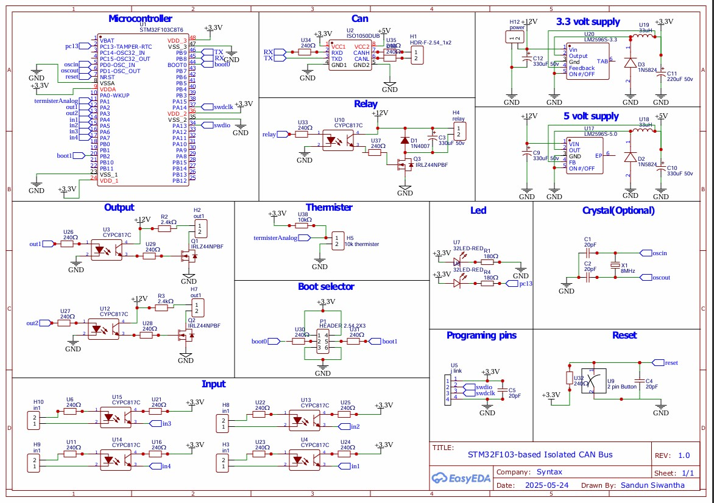

# STM32F103-based Isolated CAN Bus Circuit Design

This project features a circuit design using the STM32F103 microcontroller for an automotive application, supporting isolated CAN communication, isolated digital I/Os, analog temperature sensing, and high-voltage relay control.

## 🔧 Features

- **MCU**: STM32F103C8T6 (can be changed as needed)
- **Power Input**: 12V DC
- **CAN Bus Output**: Galvanically isolated using ISO1050 (or other chosen isolated CAN transceiver)
- **Digital Outputs**: 2 isolated 12V outputs (5mA, non-relay)
- **Digital Inputs**: 4 isolated 12V inputs
- **Relay Driver**: Capable of driving IHV50A4ANG relay
- **Temperature Sensing**: On-board thermistor connected to MCU analog input

## 📦 Files Included

- `schematic.pdf` – Complete circuit diagram
- `datasheets/` – Collection of used components

## 📘 Assumptions Made

- Isolated CAN transceiver: **Texas Instruments ISO1050** chosen for its automotive-grade, high-speed isolated interface.
- Digital isolation: **Optocouplers** (e.g., PC817 or TLP185) used for input/output isolation.
- Thermistor: **NTC 10k** selected, interfaced through voltage divider.
- High-voltage relay control: Logic-level MOSFET drives the IHV50A4ANG gate through a level shifter.
- Power regulation: Buck converter module used to generate 3.3V from 12V.

## 🔌 Applications

- Automotive high-voltage system monitoring
- Battery Management System (BMS) auxiliary control
- CAN-based industrial or vehicle modules

## 🛠️ Tools Used

- EDA Software: [EasyEDA]
- GitHub for version control and sharing

## 📸 Preview

---

## 📄 License

This project is licensed under the MIT License. See the `LICENSE` file for more information.

## ✍️ Author

H. A. K. Sandun Siwantha – [LinkedIn](https://www.linkedin.com/in/sandun-siwantha/)
